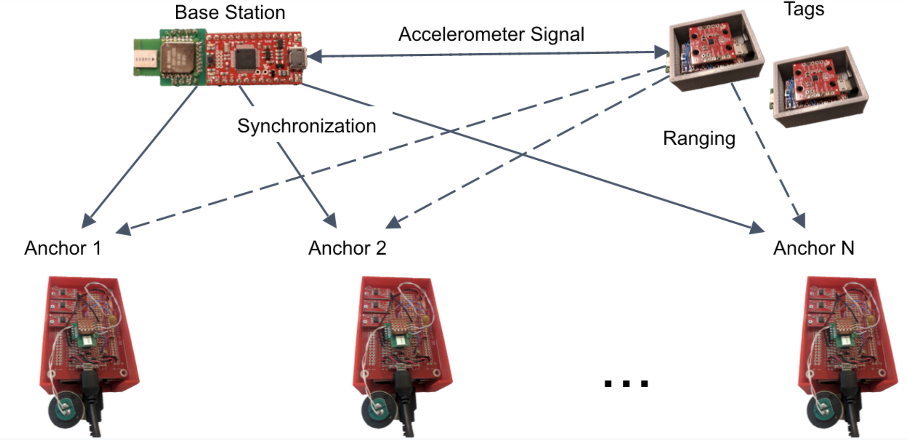
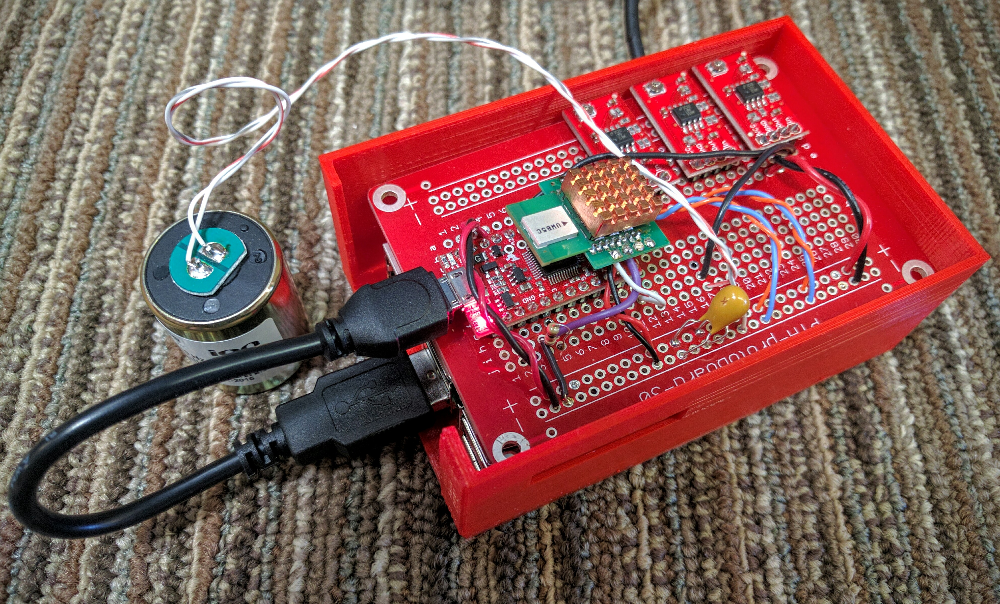

# Hardware Version 2 

The overall system functionality is described below. The Base Station controls all the synchronization through the entire system. The Tags collects foot impact timing information. The Anchors collects the vibration signal as well as the synchronization signal from the Base Station.




## Sensor Node Components




## Sensor Node Installation
The system has both raspberry pi and arduino zero part

### Arduino Zero
The setup guide for Arduino Zero can be found here:
https://learn.sparkfun.com/tutorials/samd21-minidev-breakout-hookup-guide/setting-up-arduino

To flush the code, first of all, you need to install the Arduino Zero from board manager, and remove the Arduino Due board, they are not compatible sometimes.
Then follow the guidance here: https://learn.sparkfun.com/tutorials/samd21-minidev-breakout-hookup-guide/setting-up-arduino
Make sure select SparkFun SAMD21 Mini Breakout as the board when flush.

### Raspberry Pi
First of all, download SD card installation file: 
https://www.raspberrypi.org/downloads/noobs/

Unzip the file and put the files into the SD card formatted as FAT32
Find wired mouse, keyboard, HDMI cable, ethernet cable, and a screen before you start.
Refer to 
https://www.raspberrypi.org/learning/noobs-install/elcapitan/

and
https://github.com/dandanpan/multi-people-tracking 

for the rest of the installation.

When ask for ”Enter interface name”, enter wlan0 to setup the wireless network settings

Furthermore, setup the static IP address for the node for easy access: 
https://www.raspberrypi.org/learning/networking-lessons/rpi-static-ip-address/

Enable SSH on the Pi by following this: 
https://pihw.wordpress.com/guides/direct-network-connection/


### DW1000
The DW1000 Arduino library can be found here:
https://github.com/thotro/arduino-dw1000

The modified DW1000 library is DW1000-20191218T032326Z-001.zip, the file Footstep.h has network setting that needs to be re-configured for the system, including

- NETWORK_ID
- ANCHOR_NUM
- TAG_NUM
- ANCHOR_ID_OFFSET
- TAG_ID_OFFSET 
- RADIO_RESET_COUNT

Decawave 1000: 
http://www.marketwired.com/press-release/decawave-launches-dwm1000-module-for-precise-indoor-location-and-communication-1925616.htm


### Data Collection Setup

#### Mac
The Mac is connected to the Base Station, run readcom_base.py under the designated folder.

#### Base Station 
Change the Tag and Anchor number in Footstep.h file in the library, then flash the Base Station before run readcom_base.py.

Put the updated library into the /Arduino folder.

#### Anchor
Place the anchors on the floor and power them.

#### Tag 
Place the tag on people’s leg and power with battery through USB


### Data Access
#### Base Station
Connect Base Station to Mac, and run 
```sh
python readcom_base.py
```

#### Anchor
SSH into the anchor node: 
```sh
ssh pi@<ip address>
```
```sh
ssh pi@192.168.0.2 -o UserKnownHostsFile=null
```

Sometimes use:
```sh
ssh-keygen -R 192.168.0.2
```

Find the folder location: 
```sh
cd Footstep/config/scripts/pyanchor-read/
```

Checkout collected files: 
```sh
find . -name "*.txt" -type f 
```

Disconnect SSH; return to local machine destination folder

Copy from pi to local machine: 
```sh
scp -r pi@192.168.0.2:/home/pi/Footstep/config/scripts/pyanchor-read ./
```

Delete collected files after copy out: 
```sh
find . -name "20xx-*.txt" -type f -delete
```

To access the data through Ethernet port, the ethernet setting on the Mac needs to be set to 192.168.0.1 to allow correct LAN connection.


### Data Pre-Processing
Copy all the txt files from each node into the corresponding folder.
The folder is organized as 

Anchor: /Dataset/AnchorN/copyFromPi/Footstep/

Base: /Dataset/Base/copyFromMac/

Run dataExtraction.m under corresponding folder to align the data. Define number of Tag and Anchor in the file.


